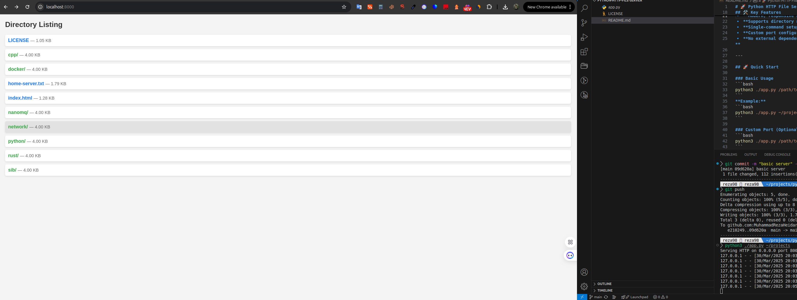

# 🚀 Python HTTP File Server  
**Muhammad Reza Heidary**  [](mailto:muhammadreza.heidary@gmail.com)  [](https://www.linkedin.com/in/muhammad-reza-heidary/)  
*Embedded Systems Designer | Python Developer | IoT & Network Solutions Specialist*  

---

## ⚡ About This Repository  
A sleek **Python HTTP File Server** designed for easy local file sharing with a clean, user-friendly interface.  

👉 **Simple Local File Sharing** – Instantly share files over your local network  
👉 **Beautiful Web Interface** – Stylish directory browsing with intuitive navigation  
👉 **Lightweight & Fast** – Minimal overhead for quick file transfers  
👉 **Custom Directory Support** – Serve files from any folder on your system  
👉 **Cross-Platform** – Works on Linux, Windows, and macOS  

---

## 🛠️ Key Features  

🔹 **Instant HTTP server for local file sharing**  
🔹 **Modern, responsive web interface**  
🔹 **Supports directory navigation with proper styling**  
🔹 **Single-command setup**  
🔹 **Custom port configuration (default: 8000)**  
🔹 **No external dependencies (uses Python's built-in HTTP server)**  

---

## 🚀 Quick Start  

### Basic Usage  
```bash
python3 ./app.py /path/to/your/directory
```
**Example:**  
```bash
python3 ./app.py ~/projects/python
```

### Custom Port (Optional)  
```bash
python3 ./app.py /path/to/directory --port 8080
```

---

## 🌟 Why Use This Server?  
✔ **Better than the default Python HTTP server** – Comes with a properly styled interface  
✔ **Perfect for local development** – Quickly share project files across devices  
✔ **No installation needed** – Just Python and one file  
✔ **Privacy-focused** – Only accessible on your local network  

---

## 🖥️ Screenshot Preview  
    

---

## 🛠️ How It Works  

👉 **Starts a lightweight HTTP server** using Python's `http.server`  
👉 **Generates a styled HTML interface** for directory browsing  
👉 **Listens on localhost** (accessible to other devices on your network)  
👉 **Provides direct file download links** with proper MIME types  

---

## 📀 Usage Examples  

### Share your Python projects  
```bash
python3 ./app.py ~/projects/python
```

### Share your downloads folder  
```bash
python3 ./app.py ~/Downloads
```

### Use a custom port (e.g., 9000)  
```bash
python3 ./app.py ~/Documents --port 9000
```

---

## 🌐 Accessing the Server  

After starting the server, open your browser and visit:  
```
http://localhost:8000
```
(or your custom port if specified)  

Other devices on your network can access it via your machine's local IP address.  

---

## 🛠️ Technical Details  

🔹 **Built with Python 3** (requires Python 3.6+)  
🔹 **Uses `http.server` as the base HTTP server**  
🔹 **Custom request handler** for styled directory listings  
🔹 **No database or external dependencies**  

---

💡 **Need a simple way to share files locally? This is your solution!** 🚀  

*"Because even simple tools deserve good design."*

